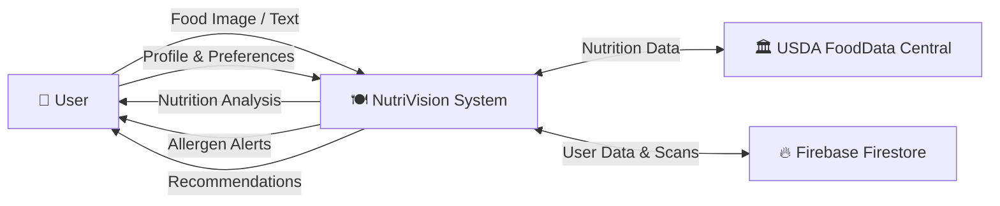
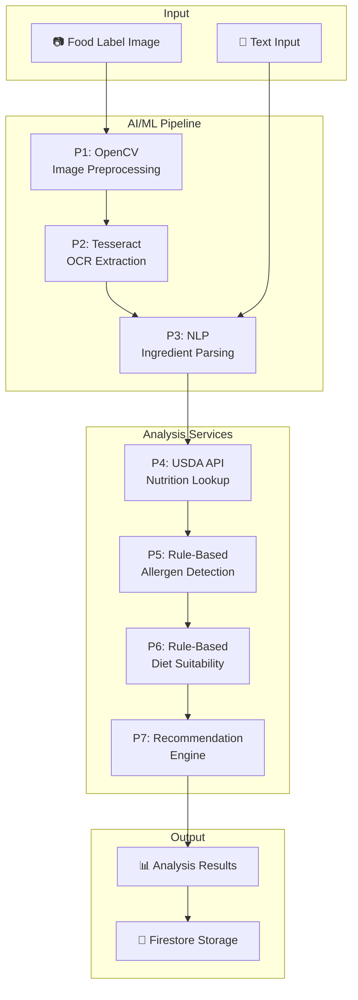

# NutriVision – Data Flow Diagrams

## Level 0: Context Diagram

```mermaid
graph LR
    User["👤 User"] -->|Food Image / Text| NV["🍽 NutriVision System"]
    User -->|Profile & Preferences| NV
    NV -->|Nutrition Analysis| User
    NV -->|Allergen Alerts| User
    NV -->|Recommendations| User
    NV <-->|Nutrition Data| USDA["🏛 USDA FoodData Central"]
    NV <-->|User Data & Scans| FB["🔥 Firebase Firestore"]
```

## Level 1: System Processes

```mermaid
graph TB
    subgraph "Input"
        IMG["📷 Food Label Image"]
        TXT["📝 Text Input"]
    end

    subgraph "AI/ML Pipeline"
        P1["P1: OpenCV<br/>Image Preprocessing"]
        P2["P2: Tesseract<br/>OCR Extraction"]
        P3["P3: NLP<br/>Ingredient Parsing"]
    end

    subgraph "Analysis Services"
        P4["P4: USDA API<br/>Nutrition Lookup"]
        P5["P5: Rule-Based<br/>Allergen Detection"]
        P6["P6: Rule-Based<br/>Diet Suitability"]
        P7["P7: Recommendation<br/>Engine"]
    end

    subgraph "Output"
        RES["📊 Analysis Results"]
        DB["💾 Firestore Storage"]
    end

    IMG --> P1 --> P2 --> P3
    TXT --> P3
    P3 --> P4 --> P5 --> P6 --> P7 --> RES
    RES --> DB
```

## Level 2: Image Analysis Detail

```mermaid
graph LR
    subgraph "OpenCV Preprocessing"
        A["Raw Image"] --> B["Decode"]
        B --> C["Resize (1024px)"]
        C --> D["Grayscale"]
        D --> E["Denoise (Gaussian)"]
        E --> F["Sharpen (Unsharp)"]
        F --> G["Adaptive Threshold"]
        G --> H["Deskew"]
    end

    subgraph "OCR"
        H --> I["Tesseract OCR"]
        I --> J["Raw Text + Confidence"]
    end

    subgraph "NLP"
        J --> K["Find Ingredient Section"]
        K --> L["Split by Separators"]
        L --> M["Clean Each Ingredient"]
        M --> N["Normalize Names"]
        N --> O["Deduplicate"]
        O --> P["Structured Ingredient List"]
    end
```
