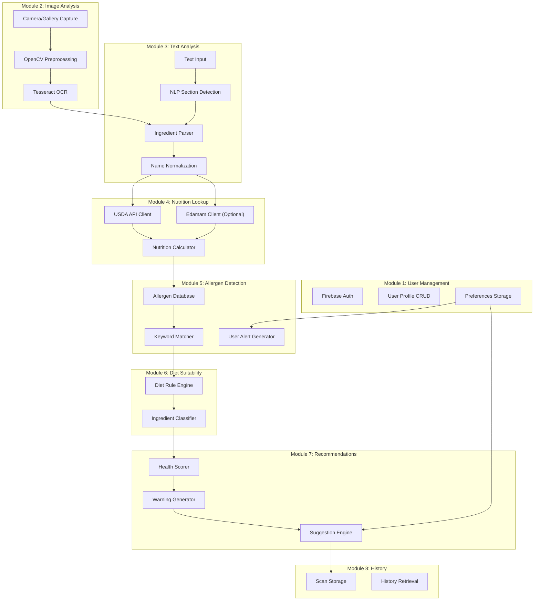

# NutriVision – Module Breakdown

## Module Architecture

## Module File Mapping

| Module | Backend Files | Android Files (Phase 5-6) |
|--------|--------------|--------------------------|
| M1: User Management | `routes/user.py`, `services/firestore_service.py`, `models/user.py` | `ui/auth/`, `data/repository/UserRepository.kt` |
| M2: Image Analysis | `ml/image_preprocessor.py`, `ml/ocr_engine.py`, `services/ocr_service.py` | `ui/scan/ImageScanFragment.kt`, `utils/ImageUtils.kt` |
| M3: Text Analysis | `ml/nlp_processor.py`, `services/ingredient_parser.py` | `ui/scan/TextInputFragment.kt` |
| M4: Nutrition Lookup | `integrations/usda_api.py`, `integrations/edamam_api.py`, `services/nutrition_service.py` | — |
| M5: Allergen Detection | `services/allergen_service.py`, `utils/constants.py` | — |
| M6: Diet Suitability | `services/diet_service.py`, `utils/constants.py` | — |
| M7: Recommendations | `services/recommendation_service.py`, `models/recommendation.py` | `ui/result/ResultFragment.kt` |
| M8: History | `routes/history.py`, `services/firestore_service.py` | `ui/history/HistoryFragment.kt` |
